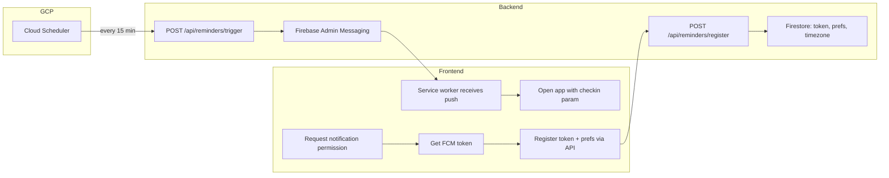

# Proactive Push Reminders (Meds + Lunch)

## Current state

- **No FCM**: Frontend uses Firebase Auth only; no Messaging SDK, no service worker for push. Backend uses `firebase_admin` for auth only.
- **No scheduler**: No Cloud Scheduler or cron; no endpoint that "wakes up" to send reminders.
- **No token or preferences**: Firestore profile ([agents/shared/firestore_service.py](agents/shared/firestore_service.py)) is merged via `save_user_profile`; there is no `fcm_token`, `reminder_meds_enabled`, `lunch_reminder_time`, or `timezone` field.
- **Medication times**: Stored per medication as `times` (e.g. `["08:00", "20:00"]`) in `users/{uid}/medications`. Schedule is derived in [agents/guardian/tools.py](agents/guardian/tools.py) (`get_medication_schedule`).
- **Check-in on open**: If the app is opened with `?checkin=true`, [app/static/js/app.js](app/static/js/app.js) already sends a system message to start a check-in; we will deep-link to that.

## Architecture

- **Registration**: User grants permission in the app; frontend gets FCM token and calls a new API to store token + reminder preferences + timezone. Backend writes to Firestore (`users/{uid}` profile).
- **Trigger**: Cloud Scheduler hits an internal-only endpoint (e.g. every 15 minutes). The handler computes "current time" in each user's timezone, finds users who have a meds slot or lunch reminder at that time, and sends one FCM message per user (with a payload that deep-links to the app and optionally indicates "meds" vs "lunch").
- **Delivery**: FCM delivers to the browser; the service worker shows the notification. When the user clicks, the app opens with `?checkin=true` (and optionally `&type=meds` or `&type=lunch`) so the existing check-in flow runs.

## 1. Firestore schema and backend profile API

- **Profile fields** (merge into `users/{uid}`):
  - `fcm_token` (string | null): current FCM device token; clear when user logs out or disables notifications.
  - `reminder_meds_enabled` (bool, default true): send "time for meds" at medication times.
  - `reminder_lunch_enabled` (bool, default true): send "log lunch" at configured time.
  - `lunch_reminder_time` (string, default `"12:00"`): HH:MM in user's timezone.
  - `timezone` (string, default `"UTC"`): IANA timezone (e.g. `America/Los_Angeles`) for computing "now" per user.
- **FirestoreService**: Add a method to fetch users who have a non-empty `fcm_token` and reminders enabled (and optionally a method to get medications for a user, which already exists). No schema migration; these are new optional fields.

## 2. Backend: FCM and reminder trigger

- **Firebase Admin Messaging**: Use `firebase_admin.messaging` (same SDK already in use) to send FCM messages. Add no new dependency.
- **Registration endpoint** (authenticated): `POST /api/reminders/register` — body: `{ "fcm_token": "...", "reminder_meds_enabled": true, "reminder_lunch_enabled": true, "lunch_reminder_time": "12:00", "timezone": "America/Los_Angeles" }`. Verify Firebase ID token from `Authorization: Bearer <id_token>`, then merge into `users/{uid}` and return success. If `fcm_token` is null or empty, clear it and treat as "disable push".
- **Trigger endpoint** (internal, secured): `POST /api/reminders/trigger` — must be callable only by Cloud Scheduler (or a cron runner). Secure with a shared secret in a header (e.g. `X-CloudScheduler-Secret` or `Authorization: Bearer <internal_secret>`), read from env (e.g. `REMINDERS_TRIGGER_SECRET`). Logic:
  1. Query Firestore for users where `fcm_token` is set and at least one of `reminder_meds_enabled` or `reminder_lunch_enabled` is true.
  2. For each user, get `timezone` and medication `times` (from `users/{uid}/medications`). Compute current time in that timezone (e.g. with `zoneinfo`).
  3. **Meds**: For each distinct time across all their medications (e.g. 08:00, 20:00), if current local time matches that slot (within the 15-minute window, e.g. 08:00–08:14), send one FCM notification: title "Time for your medications", body "Your morning/afternoon/evening doses are due. Tap to open MedLive.", data payload: `{ "url": "https://<app_origin>/?checkin=true&type=meds" }` (or path-only if you use a single origin).
  4. **Lunch**: If `reminder_lunch_enabled` and current local time matches `lunch_reminder_time` (within window), send one FCM: title "Log your lunch", body "Tap to log your meal in MedLive.", data: `{ "url": "https://<app_origin>/?checkin=true&type=lunch" }`.
  5. Optional: avoid duplicate meds reminders (e.g. only one "time for meds" per user per 15-min run) by tracking last sent time in Firestore or by design (one run per slot).
- **App base URL**: Read from env (e.g. `MEDLIVE_APP_URL` or `PUBLIC_APP_URL`) for the click link in FCM payload. Default for local dev can be `http://localhost:8000`.

## 3. Frontend: FCM and registration

- **Service worker for FCM**: Create `app/static/firebase-messaging-sw.js` (or `sw.js`) that imports Firebase Messaging and calls `onBackgroundMessage` to show a notification; on `notification.click`, open `event.notification.data?.url || /` (so the `?checkin=true&type=...` link is used when the user taps). The service worker must be at a path that the Firebase Messaging SDK expects (often `/firebase-messaging-sw.js` or root `/sw.js`). Register it from the main app (e.g. in `app.js` after Firebase init).
- **Firebase Messaging in main app**: Add `firebase-messaging-compat.js` (or modular equivalent) to [app/static/index.html](app/static/index.html). After auth, request notification permission (optional: show a short "Enable reminders?" prompt), get FCM token via `getToken(messaging, { vapidKey: '<your-web-push-vapid-key>' })`. You need a **VAPID key** (Web Push) from Firebase Console (Project Settings > Cloud Messaging > Web configuration). Send token + preferences to `POST /api/reminders/register`. Store preferences in `localStorage` or fetch from profile so the user can toggle them later (e.g. in a simple settings section).
- **Preferences UI**: Minimal option — during onboarding or first load after login, if no `fcm_token` stored, show a single "Enable medication and lunch reminders?" with Allow / Not now. If Allow, request permission, get token, call register with defaults (`lunch_reminder_time: "12:00"`, `timezone` from `Intl.DateTimeFormat().resolvedOptions().timeZone`). Optional: a "Reminders" section in settings (or a small modal) to toggle meds/lunch and set lunch time and timezone; then call `POST /api/reminders/register` again with updated prefs and same token.
- **Deep link on open**: Existing logic in [app/static/js/app.js](app/static/js/app.js) already checks `?checkin=true` and sends the check-in system message. Extend to optionally use `type=meds` or `type=lunch` in the system message so the agent can say "I see you opened from a medication reminder" or "from a lunch reminder" for a slightly more contextual greeting (optional).

## 4. Cloud Scheduler

- **Job**: One recurring job that runs every 15 minutes (or every hour at :00 if you prefer fewer runs), HTTP target: `POST https://<your-cloud-run-url>/api/reminders/trigger`, with header `Authorization: Bearer <REMINDERS_TRIGGER_SECRET>` (or `X-CloudScheduler-Secret`). Create the job in GCP Console or via Terraform (if you introduce an `infra/` later). For local dev, you can trigger the endpoint manually with curl and the secret.
- **Idempotency**: Within a 15-minute window, a user should get at most one "meds" and one "lunch" reminder. Design the trigger logic so that for a given user and reminder type, you send only once per time slot (e.g. by comparing current local time to the slot and not sending again for the same slot in the same run).

## 5. Prompts and docs

- **Agent prompts**: Update the Root/Guardian reminder wording in [agents/shared/prompts.py](agents/shared/prompts.py) so the agent says that proactive reminders *are* available: e.g. "If you've enabled reminders, you'll get a notification at your medication times and for lunch; tap to open and I'll help you log."
- **Docs**: Update [docs/REMINDERS.md](docs/REMINDERS.md) to describe the new flow (registration, trigger, FCM, deep link) and mark "Proactive time for meds push" and "Proactive log lunch push" as built.

## 6. Security and env

- **Secrets**: `REMINDERS_TRIGGER_SECRET` for the trigger endpoint; do not commit. Add to `.env.example`.
- **VAPID key**: Web Push key from Firebase; can be public (frontend). Prefer storing in env and injecting into the frontend at build time or via a small config endpoint that returns public config (e.g. `{ "vapidKey": "..." }`) so the key is not hardcoded in the repo.

## 7. Optional refinements

- **Last-sent tracking**: Store `last_reminder_meds_at` and `last_reminder_lunch_at` (or a small `reminder_sent_log` subcollection) to avoid duplicate sends if the scheduler runs twice in the same window.
- **Lunch time picker**: If you add a settings UI, allow HH:MM picker for lunch reminder time; persist via `POST /api/reminders/register`.
- **Timezone**: If not set, use browser timezone on first register and store it so the backend never has to guess.

## File and dependency summary

| Area           | Action                                                                                                                                                                                                  |
| -------------- | ------------------------------------------------------------------------------------------------------------------------------------------------------------------------------------------------------- |
| Firestore      | No schema change; add optional profile fields. FirestoreService: optional helper to list users with FCM token + reminders enabled.                                                                      |
| Backend        | New router `app/api/reminders.py`: `POST /api/reminders/register` (auth), `POST /api/reminders/trigger` (secret). Use `firebase_admin.messaging` to send. Use `zoneinfo` for timezone (stdlib in 3.9+). |
| Frontend       | Add `firebase-messaging-sw.js`; in `index.html` add Messaging SDK; in `app.js` request permission, get token, call register; optional small preferences UI.                                             |
| Scheduler      | Create Cloud Scheduler job (Console or Terraform) calling trigger URL every 15 min with secret header.                                                                                                  |
| Config         | `.env.example`: `REMINDERS_TRIGGER_SECRET`, `MEDLIVE_APP_URL`, optional `VAPID_KEY` or serve via config endpoint.                                                                                       |
| Prompts / docs | Update reminder text in prompts; update REMINDERS.md.                                                                                                                                                   |

## Order of implementation

1. Backend: Firestore profile fields (merge in register); `POST /api/reminders/register`; `POST /api/reminders/trigger` with secret, timezone-aware "who gets meds/lunch reminder now" and FCM send.
2. Frontend: Service worker for FCM; request permission and get token; call register with token + timezone + defaults; ensure app opens with `?checkin=true` when opened from notification click.
3. Cloud Scheduler: Create job and set `REMINDERS_TRIGGER_SECRET` in the environment.
4. Prompts and REMINDERS.md: Update so the agent and docs reflect that proactive reminders are available.

